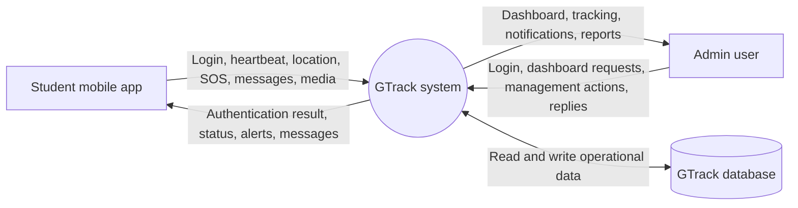
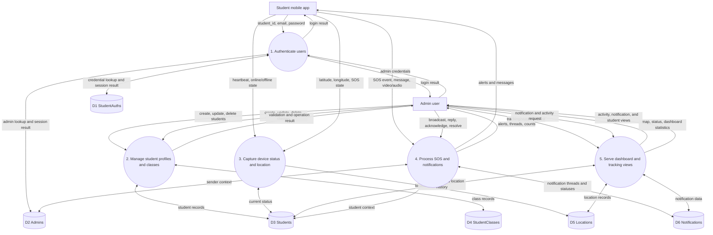

# GTrack Data Flow Diagram

This DFD describes how data moves through the GTrack web dashboard, mobile/API endpoints, application services, and database. It is based on the routes in `routes/web.php` and `routes/api.php`.

## Context Diagram

## Level 1 DFD

## Process Descriptions

| Process | Responsibility | Main data flows |
| --- | --- | --- |
| `1. Authenticate users` | Verifies admin and student credentials and establishes access. | `StudentAuths`, `Admins`, login results |
| `2. Manage student profiles and classes` | Main admins maintain students, student authentication records, and class definitions. | `Students`, `StudentClasses`, profile operation results |
| `3. Capture device status and location` | Receives heartbeats, online/offline state, coordinates, and SOS status changes. | `Students`, `Locations`, tracking data |
| `4. Process SOS and notifications` | Creates alerts/messages, stores media references, handles broadcasts, replies, acknowledgement, and resolution. | `Notifications`, `Students`, `Admins`, alert/message responses |
| `5. Serve dashboard and tracking views` | Aggregates students, locations, and notifications for admin-facing screens and statistics. | Dashboard, tracking, activity, and notification views |

## Data Store Mapping

| DFD store | Database table | Purpose |
| --- | --- | --- |
| `D1 StudentAuths` | `student_auths` | Student login credentials |
| `D2 Admins` | `admins` | Admin accounts, roles, and staff identifiers |
| `D3 Students` | `students` | Student identity, class, device status, and SOS state |
| `D4 StudentClasses` | `student_classes` | Available class/batch definitions |
| `D5 Locations` | `locations` | Student coordinates and location history |
| `D6 Notifications` | `notifications` | SOS alerts, broadcasts, messages, replies, and statuses |

## Route Coverage

- Student API: `/api/student/login`, `/api/student/heartbeat`, `/api/student/sos`, `/api/location`, and `/api/notifications/send`
- Admin API: `/api/login`, `/api/admin/broadcast`, `/api/admin/message/send/{student_id}`, and `/api/admin/notification/resolve/{id}`
- Admin web dashboard: `/dashboard`, `/tracking`, `/activity`, and `/notifications`
- Main admin management: `/admin/students`, `/admin/classes`, and `/admin/admins`
