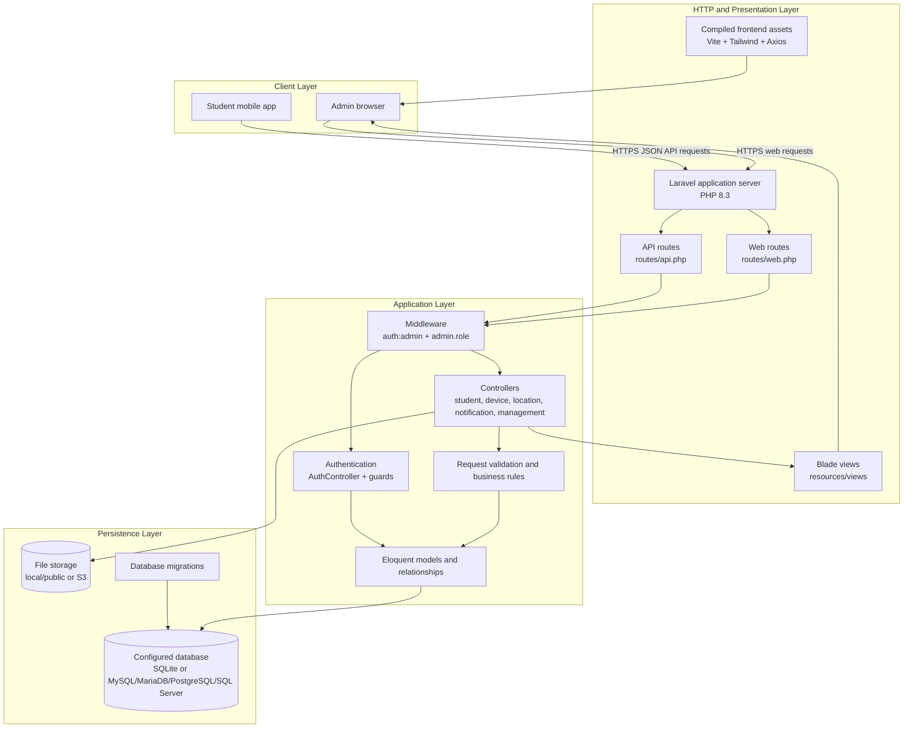
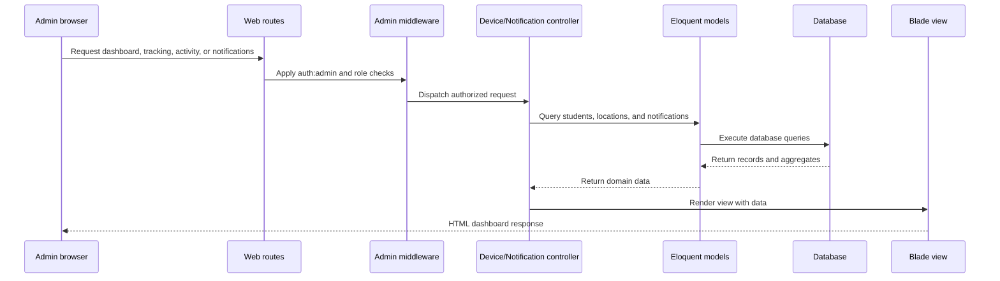
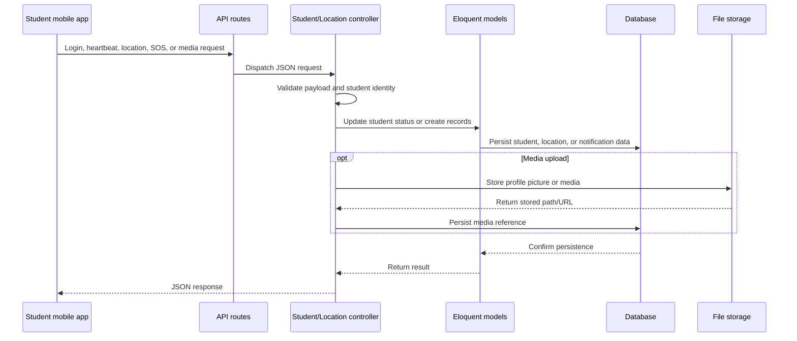
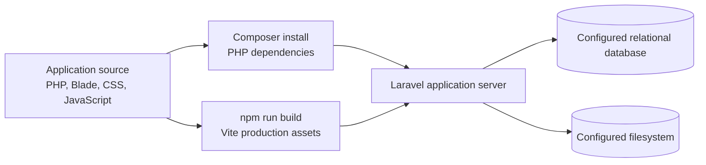

# GTrack System Architecture Diagram

GTrack is a Laravel 13 application with a web dashboard for administrators and API endpoints for the student mobile client. The architecture below reflects the current project configuration and route structure.

## Runtime Architecture

## Main Runtime Components

| Layer | Components | Responsibility |
| --- | --- | --- |
| Client | Admin browser, student mobile app | Presents the dashboard/mobile experience and sends web or JSON requests. |
| HTTP entry points | `routes/web.php`, `routes/api.php` | Maps browser and mobile requests to application actions. |
| Access control | Admin auth guard, `auth:admin`, `admin.role` | Authenticates users and restricts management actions to permitted admin roles. |
| Application services | Controllers, validation, Eloquent models | Processes authentication, student management, classes, tracking, notifications, SOS, and media uploads. |
| Presentation | Blade views, Vite, Tailwind, Axios | Renders the admin UI and builds/loads frontend assets. |
| Database | Laravel-configured relational database | Stores admins, students, classes, locations, notifications, student auth records, and framework tables. |
| File storage | Local/public disk or S3 disk | Stores uploaded profile pictures and notification media references/files. |

## Request Flows

### Admin dashboard request

### Student mobile status or SOS request

## Build and Deployment View

The development script can run the Laravel server, queue listener, log viewer, and Vite development server together. Production database and storage selection are controlled through environment variables such as `DB_CONNECTION`, `DB_DATABASE`, `FILESYSTEM_DISK`, and the related connection/storage settings.

## Source References

- `composer.json`: PHP and Laravel versions, Composer scripts, and development processes
- `package.json`: Vite, Tailwind, Axios, and frontend commands
- `vite.config.js`: frontend entry points and Laravel Vite integration
- `bootstrap/app.php`: web/API route registration and middleware aliases
- `config/database.php`: supported database connections and default selection
- `config/filesystems.php`: local, public, and S3 filesystem disks
- `routes/web.php` and `routes/api.php`: user-facing and mobile/API request boundaries
