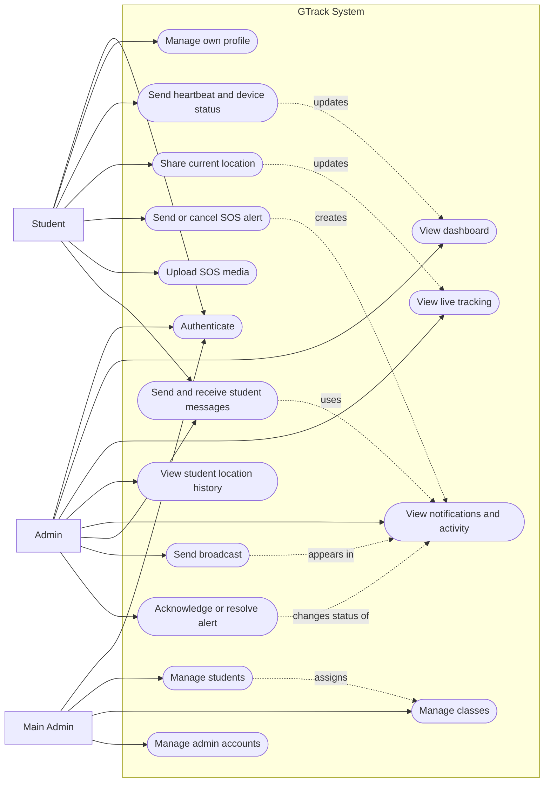

# GTrack Use Case Diagram

This diagram models the primary interactions available to GTrack users through the admin web dashboard and student mobile/API client.

## Use Case Diagram

## Actor Responsibilities

| Actor | Responsibilities |
| --- | --- |
| **Student** | Logs in through the mobile API, maintains profile information, reports heartbeat/device status, shares location, sends or cancels SOS alerts, uploads media, and exchanges messages. |
| **Admin** | Logs in, views dashboard and tracking information, reviews activity and notifications, communicates with students, sends broadcasts, and acknowledges or resolves alerts. |
| **Main Admin** | Performs all permitted admin activities and manages student records, classes, and admin accounts. |

## Use Case Summary

| Use case | Primary actor | System behavior |
| --- | --- | --- |
| Authenticate | Student, Admin, Main Admin | Validates credentials and establishes the appropriate session or API access. |
| Send heartbeat and device status | Student | Updates online status, battery, signal, and last-update information. |
| Share current location | Student | Stores coordinates and timestamped location history. |
| Send or cancel SOS alert | Student | Updates SOS state and creates or resolves the related alert workflow. |
| Upload SOS media | Student | Stores uploaded media and associates its reference with a notification. |
| View dashboard | Admin, Main Admin | Displays student status, notification counts, and operational summaries. |
| View live tracking | Admin, Main Admin | Displays current student locations and SOS states. |
| View student location history | Admin, Main Admin | Retrieves historical location records for a selected student. |
| View notifications and activity | Admin, Main Admin | Lists broadcasts, SOS alerts, messages, and status changes. |
| Send and receive student messages | Student, Admin, Main Admin | Stores and retrieves conversation threads and replies. |
| Send broadcast | Admin, Main Admin | Creates a broadcast notification for students or classes. |
| Acknowledge or resolve alert | Admin, Main Admin | Updates notification status and can return a student to a safe state. |
| Manage students | Main Admin | Creates, edits, and removes student records and student login credentials. |
| Manage classes | Main Admin | Creates, edits, and removes entries in the student class list. |
| Manage admin accounts | Main Admin | Creates, edits, and removes administrator accounts and roles. |

## Access Notes

- Admin-facing web routes are protected by the `auth:admin` middleware.
- Student and admin mobile actions are exposed through the API routes.
- Student, class, and admin management routes are additionally protected by the `admin.role:main` middleware.
- SOS alerts, broadcasts, messages, locations, and device status updates are persisted through the application models and database tables documented in the ERD.
